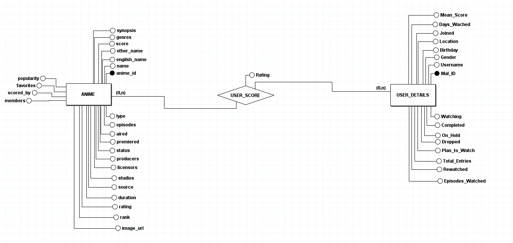

# 📚 Anime Database TCC
Sistema para fazer o carregamento dos dados de animes e mangás para o banco de dados SQL para fins de benchmark.


## 🛠 Tecnologias Utilizadas
- Java 17+

- PostgreSQL (Banco de dados)

- OpenCSV (Processamento de arquivos CSV)

- Dotenv (Gerenciamento de variáveis de ambiente)

- JDBC (Conexão com o banco de dados)


## 📊 Estrutura do Banco de Dados




## 📦 Como executar o projeto

1- Criar .env na pasta raiz com o seguintes campos:

- USER = admin
- PASSWORD = password
- DB_URL = jdbc:postgresql://localhost:5432/anime


2- Rodar o docker-compose para subir o banco de dados:
Rodar no cmd: 
```bash 
    docker-compose up -d
```

3- Baixe o dataset do Kaggle e crie a pasta data dentro resources, insira os arquvivos csv os seguintes arquivos dentro dela:

- Link para donwload do dataset: [Kaggle](https://www.kaggle.com/datasets/dbdmobile/myanimelist-dataset/data) 

- anime-dataset-2023.csv
- users-details-2023.csv
- users-score-2023.csv

4- Abra a IDE e rode o projeto

